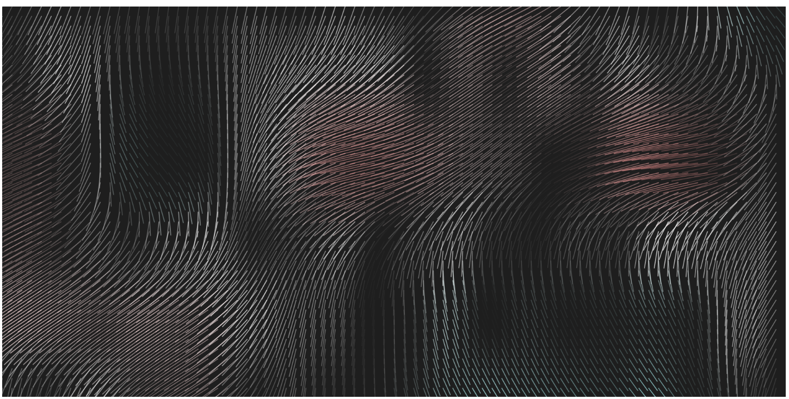

# Noisysticks Visualization

## Description

"Noisysticks" is a visualization project created using P5.js, a JavaScript library for creative coding and visual arts. The project aims to emulate the iconic Apple Drift screen saver. The visualization consists of dynamic lines that meander across the canvas, resembling the drifting motion seen in the Apple screen saver.

## How to Run

1. Simply open the "index.html" file in any web browser to experience the visualization.

## Files

- **index.js:** The JavaScript file that contains the code for generating the dynamic visualization. It utilizes P5.js functions and noise algorithms to create the drifting effect.
- **index.html:** The HTML file that serves as the entry point for running the visualization. It includes the necessary script tags to load the P5.js library and the "index.js" file.

## Usage

The visualization is generated dynamically, and users can observe the drifting lines reminiscent of the Apple Drift screen saver by opening the "index.html" file.

**Note:** Make sure to have an internet connection when opening the HTML file, as it references the P5.js library from a content delivery network (CDN).

Feel free to explore and modify the code to create your own variations of the drifting visual experience. Enjoy the mesmerizing "Noisysticks" visualization!
